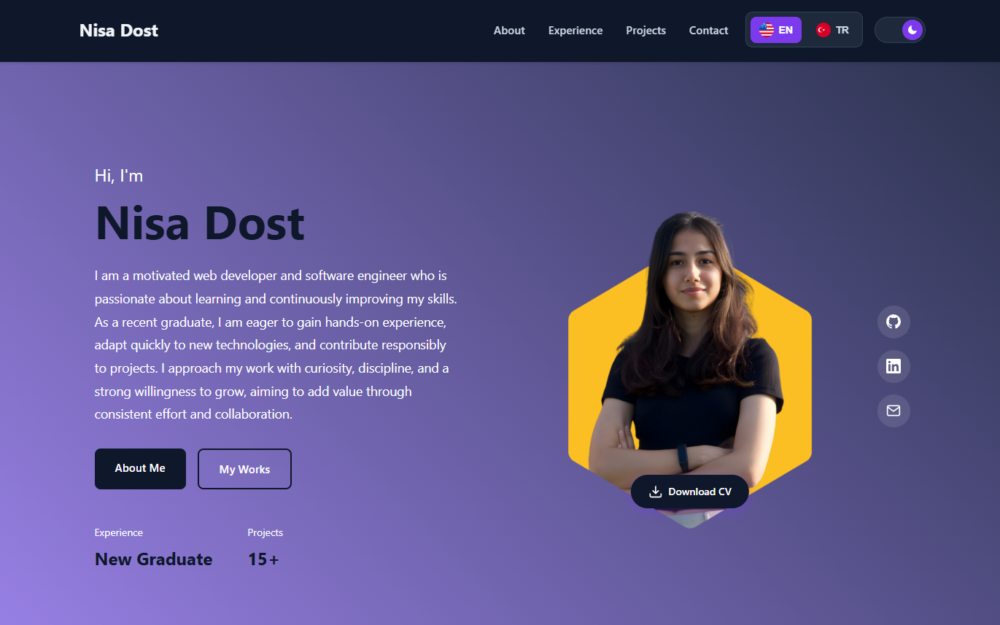

## Portfolio Website

This repository contains my personal portfolio website, developed to showcase my professional background, technical skills, and selected projects. The website is designed with a clean, responsive, and user-focused interface, reflecting modern web development practices. It serves as a centralized platform to present my experience, competencies, and work in a structured and accessible manner.

Check out my portfolio [here](https://nisadost.github.io/portfolio/).

